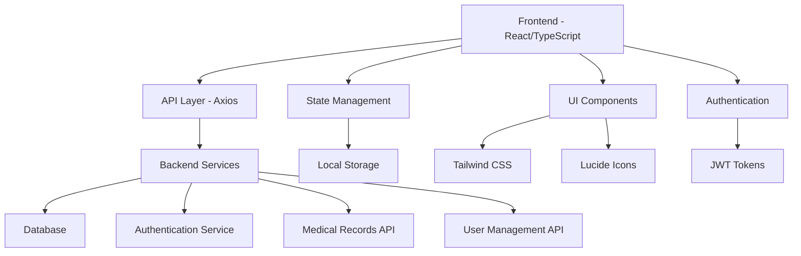

# 🏥 School Healthcare Management System

<div align="center">


**A comprehensive healthcare management system for schools built with modern web technologies**

[🚀 Live Demo](#) • [📖 Documentation](#) • [🐛 Report Bug](#) • [💡 Request Feature](#)

</div>

---

## 📋 Table of Contents

- [✨ Features](#-features)
- [🏗️ Architecture](#️-architecture)
- [🛠️ Tech Stack](#️-tech-stack)
- [🚀 Getting Started](#-getting-started)
- [📁 Project Structure](#-project-structure)
- [🔐 Authentication & Authorization](#-authentication--authorization)
- [📊 Current Progress](#-current-progress)

- [🤝 Contributing](#-contributing)
- [📄 License](#-license)

---

## ✨ Features

### 🏥 **Core Healthcare Management**
- **📋 Health Records Management** - Comprehensive student health profiles
- **💉 Vaccination Tracking** - Complete immunization records and scheduling
- **🩺 Health Checkups** - Vision, hearing, dental, and BMI assessments
- **📅 Medical Events** - Event scheduling and management system
- **🗣️ Counseling Schedules** - Mental health support scheduling

### 👥 **User Management**
- **🔐 Multi-role Authentication** (Admin, Manager, Nurse, Parent)
- **👨‍⚕️ Staff Management** - Healthcare staff profiles and permissions
- **👨‍🎓 Student Management** - Student profiles and class assignments
- **🏫 Class Management** - School class organization and hierarchy

### 📊 **Data & Analytics**
- **📈 Health Analytics** - Student health trends and statistics
- **📋 Medical Reports** - Comprehensive health reporting system
- **🔍 Advanced Search** - Multi-criteria search and filtering
- **📱 Responsive Design** - Mobile-first responsive interface

### 🎨 **User Experience**
- **🌙 Modern UI/UX** - Clean, intuitive interface design
- **⚡ Real-time Updates** - Live data synchronization
- **🔔 Notifications** - Toast notifications and alerts
- **📱 Mobile Responsive** - Optimized for all devices

---

## 🏗️ Architecture



---

## 🛠️ Tech Stack

### **Frontend Core**
- **⚛️ React 19.1.0** - Modern React with latest features
- **📘 TypeScript 5.8.3** - Type-safe development
- **⚡ Vite 6.3.5** - Lightning-fast build tool
- **🎨 Tailwind CSS 4.1.8** - Utility-first CSS framework

### **UI & Components**
- **🎭 Framer Motion 12.15.0** - Smooth animations
- **🎯 Lucide React 0.511.0** - Beautiful icons
- **📅 FullCalendar 6.1.17** - Advanced calendar component
- **🔔 React Toastify 11.0.5** - Toast notifications

### **Routing & Navigation**
- **🛣️ React Router DOM 7.6.1** - Client-side routing
- **🔒 Private Routes** - Role-based access control

### **Data & API**
- **🌐 Axios 1.9.0** - HTTP client for API calls
- **🔑 JWT Decode 4.0.0** - Token management
- **📅 Date-fns 4.1.0** - Date manipulation utilities

### **Development Tools**
- **🔍 ESLint 9.25.0** - Code linting
- **📝 TypeScript ESLint 8.30.1** - TypeScript-specific linting
- **🎨 PostCSS 8.5.4** - CSS processing

---

## 🚀 Getting Started

### **Prerequisites**
- Node.js 18+ 
- npm or yarn
- Git

### **Installation**

1. **Clone the repository**
   ```bash
   git clone <repository-url>
   cd FE
   ```

2. **Install dependencies**
   ```bash
   npm install
   ```

3. **Environment Setup**
   ```bash
   cp .env.example .env.local
   # Configure your environment variables
   ```

4. **Start development server**
   ```bash
   npm run dev
   ```

5. **Open your browser**
   ```
   http://localhost:5173
   ```

### **Available Scripts**
```bash
npm run dev      # Start development server
npm run build    # Build for production
npm run preview  # Preview production build
npm run lint     # Run ESLint
```

---

## 📁 Project Structure

```
FE/
├── 📁 public/                 # Static assets
├── 📁 src/
│   ├── 📁 components/         # Reusable UI components
│   │   ├── 📁 layout/         # Layout components
│   │   └── 📁 ui/             # UI primitives
│   ├── 📁 pages/              # Page components
│   │   ├── 📁 auth/           # Authentication pages
│   │   ├── 📁 user/           # User management
│   │   ├── 📁 student/        # Student management
│   │   ├── 📁 healthprofile/  # Health profiles
│   │   ├── 📁 medicalevents/  # Medical events
│   │   ├── 📁 class/          # Class management
│   │   └── 📁 conselingshedules/ # Counseling
│   ├── 📁 services/           # API services
│   ├── 📁 types/              # TypeScript definitions
│   ├── 📁 utils/              # Utility functions
│   ├── 📁 lib/                # Library configurations
│   └── 📁 styles/             # Global styles
├── 📄 package.json            # Dependencies
├── 📄 tsconfig.json           # TypeScript config
├── 📄 tailwind.config.js      # Tailwind config
├── 📄 vite.config.ts          # Vite config
└── 📄 README.md               # This file
```

---

## 🔐 Authentication & Authorization

### **User Roles & Permissions**

| Role | Permissions |
|------|-------------|
| **👑 Admin** | Full system access, user management, system configuration |
| **👨‍💼 Manager** | Healthcare management, staff oversight, reporting |
| **👩‍⚕️ Nurse** | Medical records, health checkups, vaccination management |
| **👨‍👩‍👧‍👦 Parent** | View child's health records, schedule consultations |

### **Protected Routes**
- JWT-based authentication
- Role-based access control
- Automatic token refresh
- Secure logout functionality

---

## 📊 Current Progress

### ✅ **Completed Features**

#### **🔐 Authentication System**
- [x] Login/Logout functionality
- [x] JWT token management
- [x] Role-based access control
- [x] Private route protection
- [x] OTP confirmation system

#### **👥 User Management**
- [x] User CRUD operations
- [x] Role assignment
- [x] Profile management
- [x] Staff directory

#### **👨‍🎓 Student Management**
- [x] Student registration
- [x] Profile management
- [x] Class assignments
- [x] Search and filtering

#### **🏫 Class Management**
- [x] Class creation and management
- [x] Student-class relationships
- [x] Hierarchical class structure

#### **🏥 Healthcare Core**
- [x] Health profile management
- [x] Medical event scheduling
- [x] Vaccination record tracking
- [x] Health checkup management
- [x] Counseling schedule system

#### **📅 Calendar System**
- [x] Interactive calendar interface
- [x] Event management
- [x] Multi-view support (day/week/month)
- [x] Event status tracking

#### **🎨 UI/UX**
- [x] Responsive design
- [x] Modern component library
- [x] Toast notifications
- [x] Loading states
- [x] Form validation

### 🚧 **In Progress**

#### **📊 Analytics & Reporting**
- [ ] Health statistics dashboard
- [ ] Medical reports generation
- [ ] Data visualization charts
- [ ] Export functionality

#### **🔔 Notification System**
- [ ] Real-time notifications
- [ ] Email notifications
- [ ] SMS alerts
- [ ] Reminder system

#### **📱 Mobile Optimization**
- [ ] PWA implementation
- [ ] Offline functionality
- [ ] Mobile-specific UI improvements

### 🎯 **Planned Features**

#### **🤖 Advanced Features**
- [ ] AI-powered health insights
- [ ] Automated health screening
- [ ] Predictive analytics
- [ ] Integration with health devices

#### **🔗 Integrations**
- [ ] Hospital management systems
- [ ] Government health databases
- [ ] Third-party medical APIs
- [ ] School information systems

#### **📈 Performance & Scalability**
- [ ] Performance optimization
- [ ] Caching strategies
- [ ] Database optimization
- [ ] Load balancing

---

## 🤝 Contributing

We welcome contributions! Please follow these steps:

1. **Fork the repository**
2. **Create a feature branch**
   ```bash
   git checkout -b feature/amazing-feature
   ```
3. **Commit your changes**
   ```bash
   git commit -m 'Add amazing feature'
   ```
4. **Push to the branch**
   ```bash
   git push origin feature/amazing-feature
   ```
5. **Open a Pull Request**

### **Development Guidelines**
- Follow TypeScript best practices
- Write meaningful commit messages
- Add tests for new features
- Update documentation
- Follow the existing code style

---

## 📞 Support

- **📧 Email**: support@schoolhealthcare.com
- **💬 Discord**: [Join our community](#)
- **📖 Documentation**: [View docs](#)
- **🐛 Issues**: [Report bugs](#)

---

## 📄 License

This project is licensed under the MIT License - see the [LICENSE](LICENSE) file for details.

---

<div align="center">

**Made with ❤️ by the School Healthcare Team**

⭐ **Star this repo if you find it helpful!** ⭐

</div>
